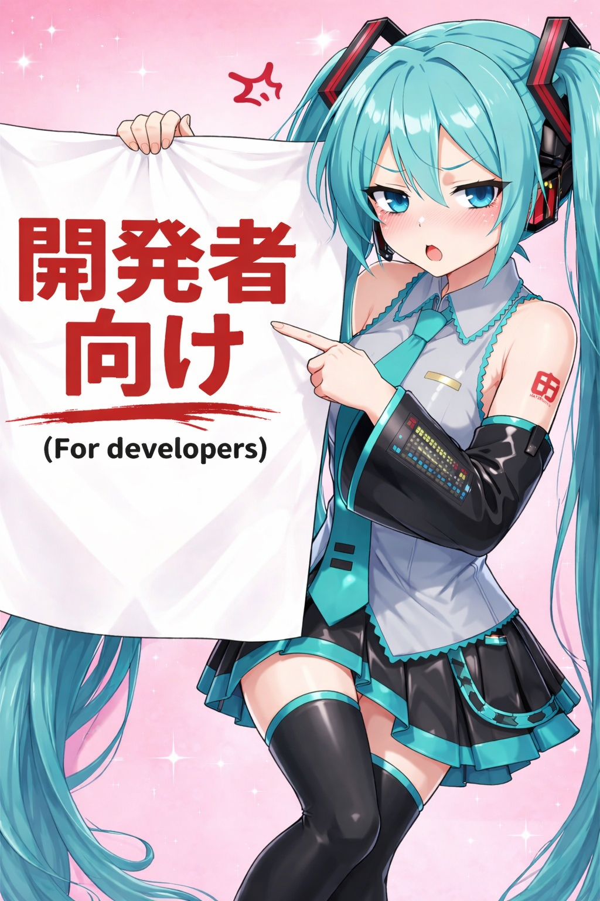

# yolo-retail-ai-agent

An AI Agent-driven inventory audit system combining YOLO object detection with LLM reasoning to detect phantom inventory, misplaced items, and automate stock replenishment.

## Instruction and Goal

See [instruction](doc/instruction.md).

## Develop

> Contents below are for developers only. Read them carefully before you do the actual work and make a git push.
>
> 

- [DEVELOPING RULES](./doc/developing_rules.md)

## Architecture

All vision inference uses **local weight files** via `model-local/`:

```text
frontend (:5173)
  ├─ stream / detect ──► model-local (:8001) ──► train/export/*.onnx
  └─ chat / agent     ──► agent (:8000) ──► model-local for image audits
```

Default weights: `train/export/goods-and-gaps-chinese-2-yolo11n.onnx`

## Dependency management

All **Python** packages in this repo are managed with **[uv](https://docs.astral.sh/uv/)**:

| Package | Path | Command |
| --- | --- | --- |
| Agent API | `agent/` | `uv sync && uv run …` |
| Local vision | `model-local/` | `uv sync && uv run …` |
| Training | `train/` | `uv sync && uv run …` |
| Dataset download | `dataset/` | `uv sync && uv run …` |

Frontend remains **npm** (`frontend/`).

## Quick start

### 1. Local vision service

```bash
cd model-local
uv sync
uv run stream_server.py
```

### 2. Agent backend

```bash
cd agent
uv sync
cp .env.example .env
uv run uvicorn app.main:app --reload --port 8000
```

### 3. Frontend

```bash
cd frontend
cp .env.example .env
# set VITE_API_BASE_URL=http://localhost:8000
# set VITE_STREAM_BASE_URL=http://localhost:8001
npm install
npm run dev
```

Open `http://localhost:5173`.

## Frontend

See [frontend/README.md](frontend/README.md).

## Training & datasets

- Training: [train/README.md](train/README.md) — `cd train && uv sync && uv run python train.py …`
- Dataset download (Roboflow API key for **download only**):
  - [sku-1kimg-yolov8.py](dataset/sku-1kimg-yolov8.py)
  - [sku-gap-700img-yolov8.py](dataset/sku-gap-700img-yolov8.py)

  ```bash
  cd dataset && uv sync && uv run python sku-gap-700img-yolov8.py
  ```

## Tests

```bash
cd agent && uv run pytest
cd model-local && uv run pytest
```
